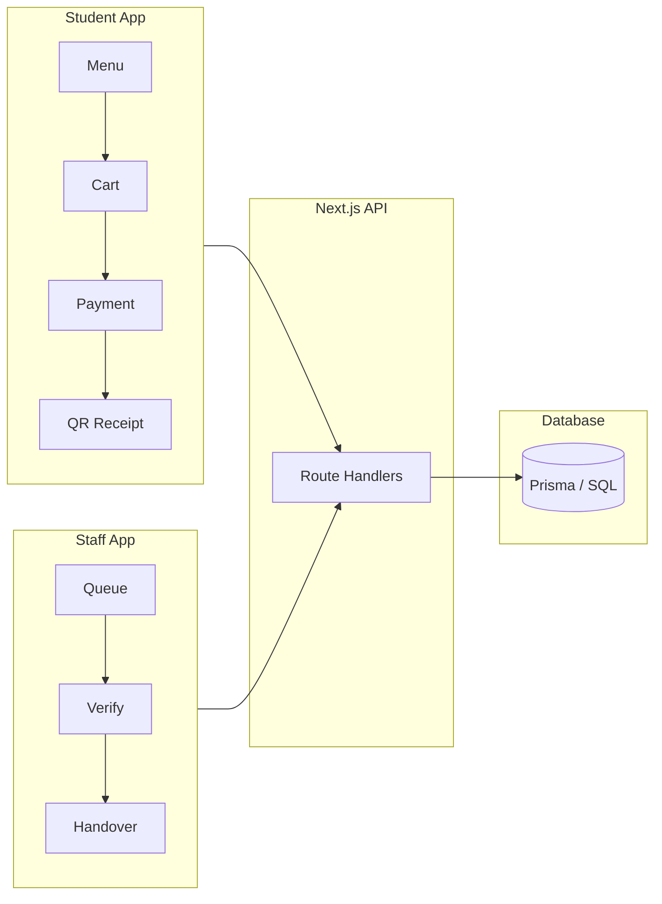

# CampusCanteen

**Smart inventory-aware canteen pre-ordering for college campuses.**

[](docs/RC1_RELEASE.md)
[](docs/TESTING.md)
[](docs/PROJECT_METRICS.md)
[](#)

Students browse **live stock**, pay online, and collect food with a **token + QR code**. Staff manage the **pickup queue**, **verify pickups**, **update inventory**, and view **daily sales** — all from a mobile-first progressive web app.

> **RC1 status:** Feature-frozen release candidate for campus demo and portfolio. Payments are **simulated** — not production-ready for real money. See [Known limitations](#known-limitations).

**Live demo:** *[Add your Netlify URL]*  
**Docs:** [Architecture](docs/ARCHITECTURE.md) · [Demo script](docs/DEMO_SCRIPT.md) · [Interview guide](docs/INTERVIEW_GUIDE.md)

---

## Project overview

College canteens often oversell batch-prepared items and create long pickup queues. CampusCanteen solves this by:

1. Showing **real-time availability** (Available / Only N left / Sold out)
2. **Validating stock** at cart, order, and payment
3. **Deducting inventory** only after successful payment
4. Issuing a **digital pickup token + QR** so staff verify the correct student
5. Giving staff a **live queue**, inventory tools, and sales insights

Cash counter sales are handled manually via staff **Sold out / Available** toggles.

---

## Features

### Student

- Category-filtered menu with availability indicators and daily specials
- Mobile cart (bottom sheet) and desktop sidebar checkout
- Cart validation before review; order summary with server-side pricing
- Simulated online payment (UPI, Google Pay, PhonePe, Paytm, Card)
- QR receipt with pickup token and order tracking stepper
- Order history, reorder, cancel pending/paid orders (with stock restore)
- Browser notifications when order is ready
- PWA install support for phone home screen

### Staff

- Live pickup queue with order details
- QR scan or manual token verification with pickup secret
- Mark packed & ready; confirm handover to complete orders
- Menu CRUD (create, edit, delete items)
- Inventory restock, set quantity, sold-out toggle
- Today's sales dashboard (revenue, orders, top items)
- 14-day demand forecast for batch prep

### Security

- bcrypt password hashing, JWT HTTP-only session cookies
- Role-based API authorization (student / staff)
- Staff UI protected by Next.js middleware
- Zod input validation on all mutating endpoints
- Rate limiting on auth, orders, payments, verify
- QR v2 pickup secret — timing-safe verification; secret stripped from API responses

### Testing

- **70** Vitest tests (unit + integration)
- **6** Playwright E2E tests including full checkout → handover
- **~50%** line coverage on `src/lib` + `src/app/api`
- GitHub Actions: lint, test, production build

---

## Screenshots

*Add captures to `docs/screenshots/` — see [screenshot guide](docs/screenshots/README.md).*

| Student menu | Cart & review |
|:---:|:---:|
|  |  |
| *Category filters & availability* | *Mobile cart / review step* |

| Checkout | QR receipt |
|:---:|:---:|
|  |  |
| *Payment method selection* | *Token + QR for pickup* |

| Staff queue | Menu CRUD |
|:---:|:---:|
|  |  |

| Inventory | Dashboard |
|:---:|:---:|
|  |  |

| QR verification |
|:---:|
|  |

---

## Architecture



**High-level design:**

- **Monolith:** Next.js 16 App Router — React UI + API routes in one deployable unit
- **State:** Custom hooks (`useStudentApp`, `useStaffApp`) + panel components (Sprint 7 refactor)
- **Business logic:** `src/lib/*` — lifecycle, inventory, tokens, rate limits
- **Auth:** JWT in HTTP-only cookie; `requireSession()` on every protected route

Full detail: **[docs/ARCHITECTURE.md](docs/ARCHITECTURE.md)**

---

## Tech stack

| Layer | Technology |
|-------|------------|
| **Frontend** | React 19, TypeScript, Tailwind CSS 4, Lucide icons |
| **Backend** | Next.js 16 Route Handlers, Zod validation |
| **Database** | Prisma 6 — SQLite (local) · PostgreSQL / Neon (production) |
| **Authentication** | bcryptjs, jose (JWT), HTTP-only cookies |
| **QR** | `qrcode` (server), `html5-qrcode` (staff scanner, lazy-loaded) |
| **Charts** | Recharts (staff forecast) |
| **Testing** | Vitest, Playwright, V8 coverage |
| **CI/CD** | GitHub Actions |
| **Deployment** | Netlify + `@netlify/plugin-nextjs`, Neon PostgreSQL |

---

## Installation

**Prerequisites:** Node.js 20+, npm

```bash
git clone https://github.com/manoj-9899/CampusCanteen.git
cd canteen-preorder

copy .env.example .env    # Windows
# cp .env.example .env    # Mac/Linux

npm install
npm run db:setup          # SQLite: prisma/dev.db + seed
npm run dev
```

Open **http://localhost:3000**

| Role | Email | Password |
|------|-------|----------|
| Student | student@college.edu | student123 |
| Staff | staff@canteen.edu | staff123 |

Detailed setup: **[SETUP.md](SETUP.md)**

### Phone testing (same Wi‑Fi)

```text
http://YOUR_LAPTOP_IP:3000        # student
http://YOUR_LAPTOP_IP:3000/staff  # staff
```

---

## Deployment

**Recommended:** Netlify + Neon (free tier).

1. Create [Neon](https://neon.tech) PostgreSQL database
2. Run once: `npm run db:setup:neon` with Neon `DATABASE_URL`
3. Connect repo on [Netlify](https://www.netlify.com)
4. Set env vars: `DATABASE_URL`, `JWT_SECRET`
5. Deploy — `netlify.toml` handles PostgreSQL schema swap

| Guide | Purpose |
|-------|---------|
| [docs/NETLIFY.md](docs/NETLIFY.md) | Step-by-step deploy |
| [docs/DEPLOYMENT_CHECKLIST.md](docs/DEPLOYMENT_CHECKLIST.md) | RC1 checklist + rollback |
| [docs/RC1_RELEASE.md](docs/RC1_RELEASE.md) | Release notes & limitations |

---

## Testing

```bash
npm test                 # 70 Vitest tests
npm run test:coverage    # ~50% on lib + API
npm run test:e2e         # 6 Playwright (npx playwright install chromium)
npm run lint
npm run build:netlify    # Production build smoke test
```

See **[docs/TESTING.md](docs/TESTING.md)**

---

## Known limitations

| Limitation | RC1 status |
|------------|------------|
| Payments | Simulated only — no Razorpay |
| Demo passwords | Seed uses `student123` / `staff123` — rotate on public URLs |
| Database | `db push` only — no Prisma migrations |
| Registration | Open student sign-up (rate-limited) |
| Notifications | Browser events only — no push/SMS |
| Rate limits | In-memory per server instance |

Full list: **[docs/RC1_RELEASE.md](docs/RC1_RELEASE.md)**

---

## Documentation index

| Document | Description |
|----------|-------------|
| [ARCHITECTURE.md](docs/ARCHITECTURE.md) | System design & diagrams |
| [DEMO_SCRIPT.md](docs/DEMO_SCRIPT.md) | Live presentation walkthrough |
| [INTERVIEW_GUIDE.md](docs/INTERVIEW_GUIDE.md) | Technical Q&A |
| [RESUME_BULLETS.md](docs/RESUME_BULLETS.md) | Portfolio / resume copy |
| [PROJECT_METRICS.md](docs/PROJECT_METRICS.md) | Codebase statistics |
| [ORDER_LIFECYCLE.md](docs/ORDER_LIFECYCLE.md) | Status transition rules |
| [QR_PICKUP_SECURITY.md](docs/QR_PICKUP_SECURITY.md) | Pickup secret design |
| [PAYMENT_FLOW.md](docs/PAYMENT_FLOW.md) | Payment state machine |
| [CAMPUS_CANTEEN_CHECKLIST.md](CAMPUS_CANTEEN_CHECKLIST.md) | Full feature audit |

---

## Order flow

```text
PENDING → (payment) → CONFIRMED → READY_FOR_PICKUP → (verify) → (handover) → COMPLETED
```

---

## License

Academic mini project — see repository for usage context.
