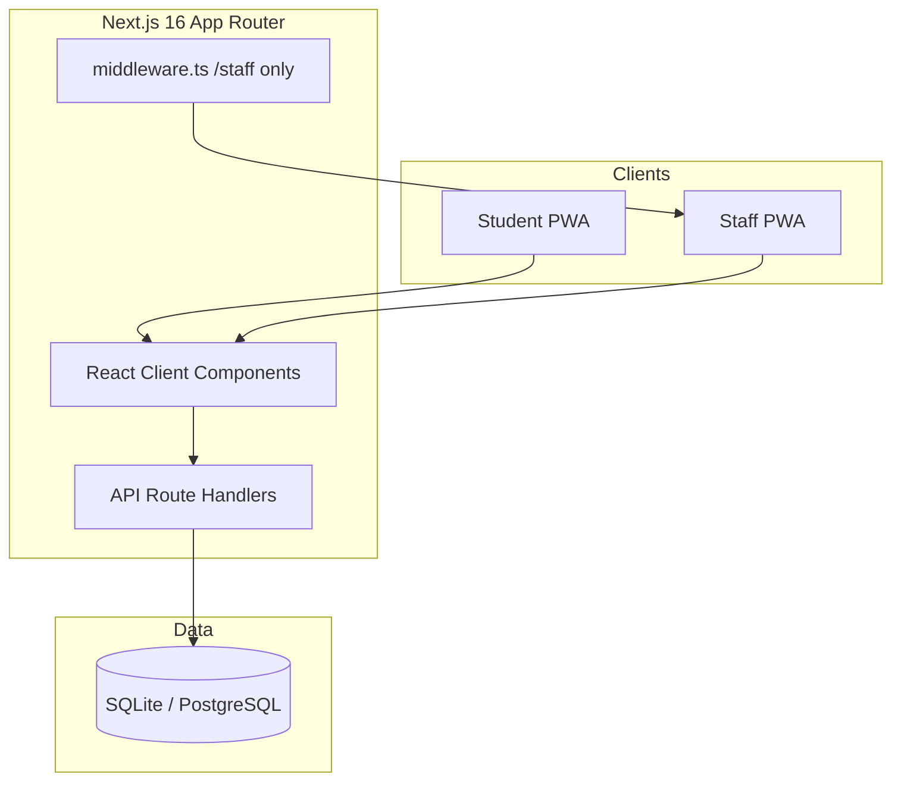
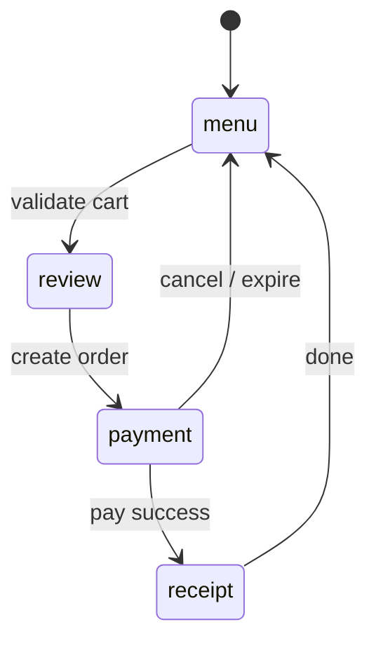
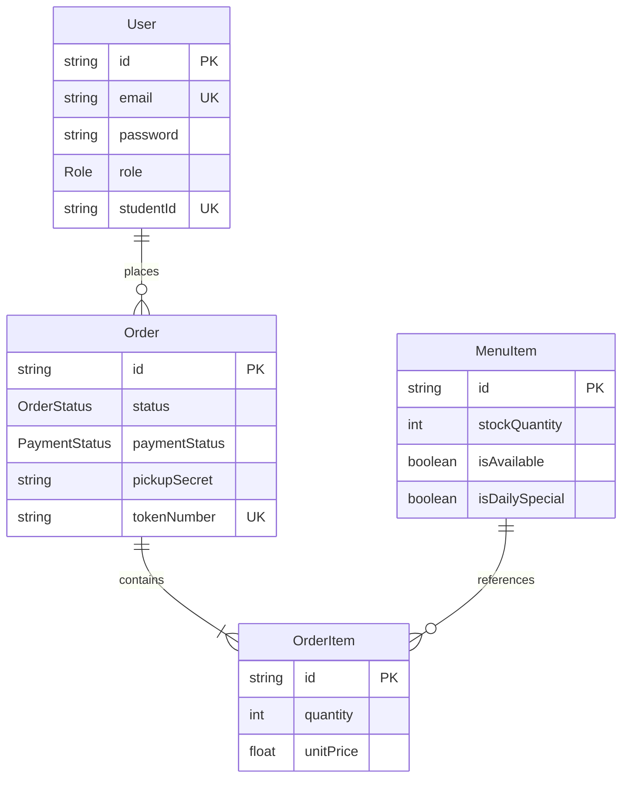
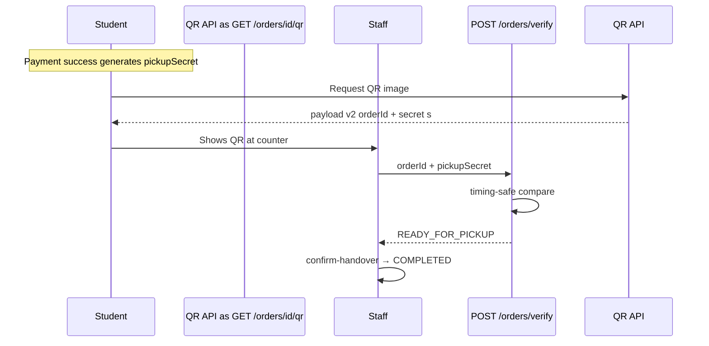
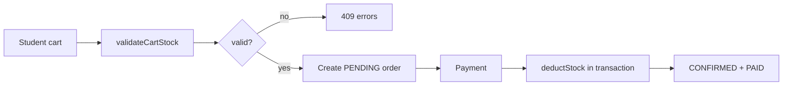

# CampusCanteen Architecture

> **Version:** `1.0.0-rc1` · High-level system design for portfolio and technical interviews.

---

## System overview

CampusCanteen is a **full-stack Next.js monolith**: React client components talk to **Route Handlers** (`src/app/api/*`) backed by **Prisma** and a relational database (SQLite locally, PostgreSQL on Neon).



**Design principles:**

- Inventory checked **before** order create and **again** at payment (race protection)
- Order status and payment status are **separate fields**
- Pickup secret never returned in order JSON — only embedded in QR payload server-side
- Staff UI split from student UI (`/` vs `/staff`) with role-based API guards

---

## Frontend architecture

### Student flow

| Layer | Responsibility |
|-------|----------------|
| `StudentApp.tsx` | Layout shell, step routing |
| `useStudentApp.ts` | Menu, cart, checkout, payment, receipt state |
| Panels | `StudentMenuPanel`, `StudentCartPanel`, `StudentCheckoutPanel` |
| Checkout steps | `menu` → `review` → `payment` → `receipt` |



**Key behaviors:** cart sync on menu poll, 15-minute pending expiry, offline detection via `fetch-client`, visibility-aware polling on receipt.

### Staff flow

| Layer | Responsibility |
|-------|----------------|
| `StaffApp.tsx` | Tab shell (queue, verify, menu, inventory, sales, forecast) |
| `useStaffApp.ts` | Queue polling, verify, inventory, menu CRUD, analytics |
| `StaffVerifyPanel` | QR scanner (lazy `html5-qrcode`) + manual token entry |

Staff queue polls every 5s when tab visible. Verify promotes `CONFIRMED` → `READY_FOR_PICKUP`; handover completes via `confirm-handover`.

---

## Backend architecture

### API routes (16 files, 22 handlers)

| Domain | Routes |
|--------|--------|
| Auth | `POST /api/auth`, `GET/DELETE /api/auth/session` |
| Menu | `GET/POST /api/menu`, `PATCH/DELETE /api/menu/[id]` |
| Cart | `POST /api/cart/validate` |
| Orders | `GET/POST /api/orders`, `GET/PATCH /api/orders/[id]`, cancel, confirm-handover, qr, queue, verify |
| Payments | `POST /api/payments` |
| Inventory | `GET/PATCH /api/inventory` |
| Analytics | `GET /api/analytics/daily`, `GET /api/forecast` |

### Authentication

- **Register / login:** `POST /api/auth` → bcrypt hash → JWT in HTTP-only cookie (`canteen_session`, 7 days)
- **Session:** `GET /api/auth/session` re-validates user against DB (`SESSION_STALE` if DB reset)
- **Production:** `JWT_SECRET` required (`jwt-config.ts`)

### Authorization

| Guard | Mechanism |
|-------|-----------|
| Student-only routes | `requireSession(["STUDENT"])` |
| Staff-only routes | `requireSession(["STAFF"])` |
| Order ownership | `order.userId === session.id` on student order APIs |
| Staff UI | `middleware.ts` on `/staff/*` |

### Cross-cutting

- **Validation:** Zod on all mutating endpoints
- **Rate limits:** In-memory per IP/user (`rate-limit.ts`) — auth, orders, payments, verify
- **Errors:** `jsonError`, `handleAuthError` in `api-utils.ts`

---

## Database architecture

### Prisma models (4)



**Indexes:** `Order` — `[userId, createdAt]`, `[paymentStatus, status, createdAt]`; `MenuItem` — `[isDailySpecial]`.

**Local:** SQLite `prisma/dev.db` · **Production:** Neon PostgreSQL via schema swap at Netlify build.

---

## QR verification architecture



- QR v2: `{ v: 2, orderId, s }` — see `docs/QR_PICKUP_SECURITY.md`
- `stripPickupSecret()` on all order API responses
- Legacy orders without secret: token/order code only (pre-Sprint-8)

---

## Inventory management architecture



- **Staff:** `PATCH /api/inventory` — restock, set quantity, toggle `isAvailable`
- **Cancel paid order:** `restoreStock()` via `order-lifecycle.ts`
- **Unpaid cancel / expiry:** no stock change (never deducted)

---

## Order lifecycle architecture

Central module: `src/lib/order-lifecycle.ts`

| Transition | Actor | Stock |
|------------|-------|-------|
| → PENDING | Student create | — |
| PENDING → CONFIRMED | Payment | Deduct |
| PENDING → CANCELLED | Cancel / 15m expiry | — |
| CONFIRMED → READY_FOR_PICKUP | Staff verify / mark ready | — |
| READY_FOR_PICKUP → COMPLETED | Staff handover | — |
| CONFIRMED → CANCELLED | Student cancel | Restore |

Full matrix: `docs/ORDER_LIFECYCLE.md`

---

## Testing architecture

| Layer | Tool | Scope |
|-------|------|-------|
| Unit | Vitest | `src/lib/*` — inventory, lifecycle, QR, rate limits |
| Integration | Vitest | API route handlers with mocked `next/headers` |
| E2E | Playwright | Auth, staff protection, full checkout |
| CI | GitHub Actions | lint, test, `build:netlify` |

Test DB: isolated SQLite `prisma/test.db` via `prepare-test-prisma.mjs`.

---

## Deployment architecture

```
GitHub → Netlify build
  → netlify-build.mjs (PostgreSQL schema)
  → prisma generate + next build
  → @netlify/plugin-nextjs
Runtime: Neon DATABASE_URL + JWT_SECRET
```

See `docs/DEPLOYMENT_CHECKLIST.md` and `docs/NETLIFY.md`.
