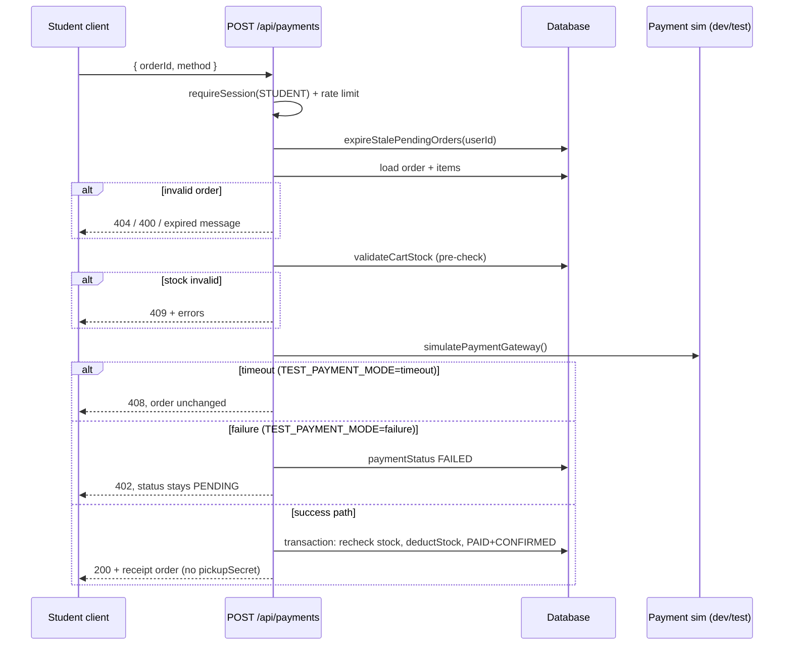
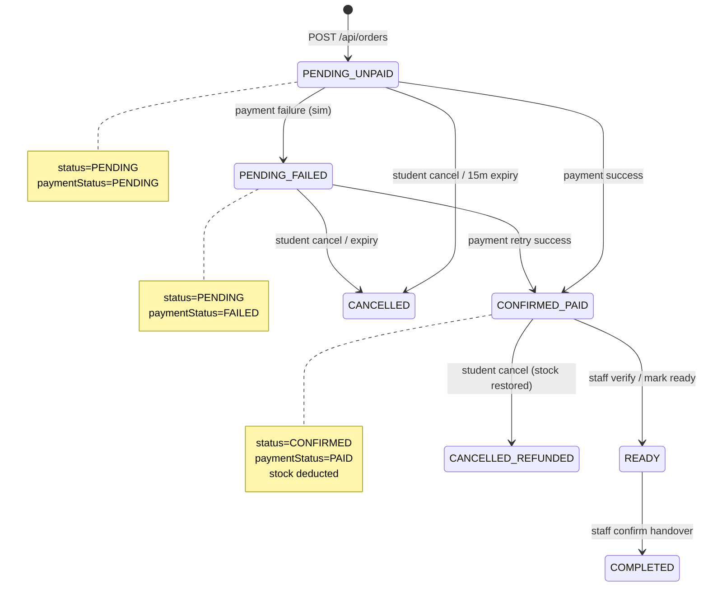

# Payment Flow Audit (Sprint 10)

> **Endpoint:** `POST /api/payments` (`src/app/api/payments/route.ts`)  
> **Related:** `POST /api/cart/validate`, `POST /api/orders`, `POST /api/orders/[id]/cancel`

## Current flow



### Preconditions

| Check | Response |
| ----- | -------- |
| Not logged in | 401 |
| Wrong user / missing order | 404 |
| Already `PAID` | 400 |
| `CANCELLED` | 400 (expired message) |
| Pending > 15 min | Auto-cancel + 400 expired |
| `status !== PENDING` | 400 cannot be paid |
| Stock invalid (pre-check) | 409 + `errors[]` |

### Success path

1. Simulated gateway returns success (default).
2. Transaction re-validates stock, deducts inventory, updates order:
   - `paymentStatus` → `PAID`
   - `status` → `CONFIRMED`
   - `pickupSecret` generated
   - `paymentRef` + `paymentMethod` set
3. Response: `{ success: true, paymentRef, order, message }`

### Failure path (Sprint 10)

When `TEST_PAYMENT_MODE=failure` (dev/test only):

- `paymentStatus` → `FAILED`
- `status` remains `PENDING`
- Stock **not** deducted
- Response: `402` with `{ success: false, error }`
- Student may retry payment (route allows `FAILED` + `PENDING`)

### Expiry path

Handled **before** payment attempt:

- `expireStalePendingOrders()` on each payment request
- Orders with `PENDING` + `paymentStatus PENDING` older than 15 minutes → `CANCELLED`
- Payment on expired order returns lifecycle expired message

Cancellation is separate: `POST /api/orders/[id]/cancel` (student, while `PENDING`).

### Timeout path (Sprint 10)

When `TEST_PAYMENT_MODE=timeout` (dev/test only):

- No database mutation
- Response: `408` — order stays `PENDING` / `paymentStatus PENDING`

### Stock-changed path

| When | Behaviour |
| ---- | --------- |
| Pre-check fails | 409 before gateway sim |
| Race during transaction | 409 `"Inventory changed while processing payment…"` |
| `TEST_PAYMENT_MODE=stock_changed` | Forces transaction failure (409) after pre-check passes |

## Payment state diagram



## Inventory impact

| Event | Stock |
| ----- | ----- |
| Order created (`PENDING`) | No change |
| Payment success | `deductStock()` per line item |
| Payment failure / timeout | No change |
| Pre-check or race 409 | No change |
| Paid student cancel | `restoreStock()` |
| Unpaid cancel / expiry | No change (never deducted) |

## Missing states (before Sprint 10)

| State | Issue |
| ----- | ----- |
| `paymentStatus: FAILED` | Enum existed; never written |
| Timeout / abandoned payment | No distinct status; order stays pending |
| Payment in progress | No `PROCESSING` lock (double-pay race possible) |
| Idempotent retry key | No `Idempotency-Key` header |

## Missing validations (before Sprint 10)

| Gap | Risk |
| --- | ---- |
| No real gateway signature / webhook | Production payments blocked by design |
| No price re-check at payment | Price frozen at order create (`unitPrice` on lines) — acceptable |
| `FAILED` not surfaced in UI | Client shows generic error only |
| No payment attempt audit log | Harder ops debugging |
| Concurrent duplicate POST /api/payments | Second call may 400 "already paid" after first succeeds — OK |

## Simulation (dev/test only)

```bash
# Default — success after ~500ms (25ms in Vitest)
TEST_PAYMENT_MODE=success

# Decline — FAILED, order stays pending
TEST_PAYMENT_MODE=failure

# Gateway timeout — 408, no DB change
TEST_PAYMENT_MODE=timeout

# Simulated inventory race — 409 after pre-check
TEST_PAYMENT_MODE=stock_changed
```

**Production:** `NODE_ENV=production` ignores `TEST_PAYMENT_MODE`; behaviour is always success simulation (until Razorpay).
